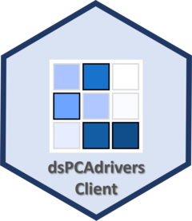

# dsPCAdriversClient 

Client-side companion to [dsPCAdrivers](https://github.com/elisabettasciacca/dsPCAdrivers): visualise which variables drive variation along principal components in a federated (DataSHIELD) setting, without any individual-level data leaving the servers.

`ds.plotDrivers()` computes PCA internally via `dsSwissKnifeClient::dssPrincomp()` — no pre-existing PCA object is required — and returns a heatmap of variable-PC associations, either pooled across sites (`type = "combine"`) or computed independently per site (`type = "split"`).

## Installation

```r
# install.packages("remotes")
remotes::install_github("elisabettasciacca/dsPCAdriversClient")
```

The server-side package, [dsPCAdrivers](https://github.com/elisabettasciacca/dsPCAdrivers), must also be installed on each DataSHIELD server by the server administrator.

## Quick start

The example below uses [DSLite](https://cran.r-project.org/package=DSLite) to simulate a two-site DataSHIELD setup locally, using the `site_data` example dataset included in the package.

```r
library(DSLite)
library(DSI)
library(dsPCAdrivers)
library(dsPCAdriversClient)
library(dsBaseClient)
library(dsSwissKnifeClient)

data(site_data)

dslite.server <- DSLite::newDSLiteServer(
  tables = list(
    site1_expr     = site_data$site1$expr,
    site2_expr     = site_data$site2$expr,
    site1_clinical = site_data$site1$clinical,
    site2_clinical = site_data$site2$clinical
  )
)
dslite.server$config(DSLite::defaultDSConfiguration(
  include = c("dsBase", "dsSwissKnife", "dsPCAdrivers")
))
dslite.server$aggregateMethod("plotDriversDS", dsPCAdrivers::plotDriversDS)

# Relax privacy filters FOR LOCAL TESTING ONLY - never use with real data
options(
  datashield.privacyControlLevel = "permissive",
  nfilter.tab = 3, nfilter.subset = 3, nfilter.glm = 1.0,
  nfilter.string = 80, nfilter.kNN = 3
)

builder <- DSI::newDSLoginBuilder()
builder$append(server = "site1", url = "dslite.server", table = "site1_expr", driver = "DSLiteDriver")
builder$append(server = "site2", url = "dslite.server", table = "site2_expr", driver = "DSLiteDriver")
conns <- DSI::datashield.login(logins = builder$build(), assign = FALSE)

DSI::datashield.assign.table(conns, "expression_data", c(site1 = "site1_expr", site2 = "site2_expr"))
DSI::datashield.assign.table(conns, "clinical_vars",   c(site1 = "site1_clinical", site2 = "site2_clinical"))

ds.plotDrivers(
  data        = "expression_data",
  vars        = "clinical_vars",
  datasources = conns,
  type        = "combine",
  n_pc        = 5
)

DSI::datashield.logout(conns)
```

For the full walkthrough — site-specific analysis, p value adjustment, plot customisation, returning results as a data frame, and privacy guarantees — see `vignette("plotDrivers_vignette", package = "dsPCAdriversClient")`.

## License

GPL-3
