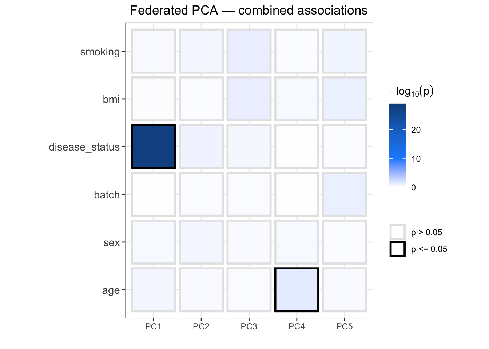
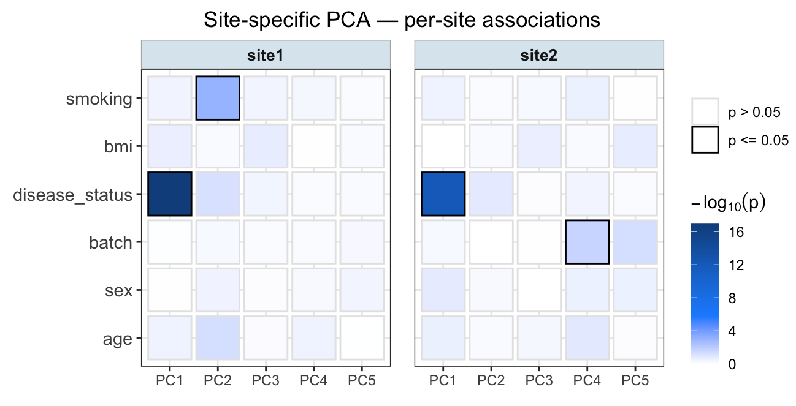

```{r setup, include = FALSE}
knitr::opts_chunk$set(
  collapse  = TRUE,
  comment   = "#>",
  fig.width = 7,
  fig.height = 5
)

# DSLite demo chunks run only if all required packages are available
run_dslite <- requireNamespace("DSLite",            quietly = TRUE) &&
              requireNamespace("DSI",               quietly = TRUE) &&
              requireNamespace("dsBaseClient",       quietly = TRUE) &&
              requireNamespace("dsSwissKnifeClient", quietly = TRUE) &&
              requireNamespace("dsPCAdrivers",       quietly = TRUE)
```

# Introduction

`ds.plotDrivers()` generates a tile plot of statistical associations between
principal components (PCs) and clinical or technical variables in a federated
DataSHIELD setting.   
PCA is computed internally via `dsSwissKnifeClient::dssPrincomp()` — no 
pre-existing PCA object is required.   
Only aggregate statistics (p values) leave the servers, preserving
individual-level data privacy.  
  
The function supports two modes of analysis:
  
- **Federated analysis** (`type = "combine"`): a single PCA is
  computed on the pooled covariance matrix across all sites. All sites share the
  same PC loadings, making cross-site p value combination statistically
  meaningful. P values are combined using Fisher's method and a single heatmap
  is returned.
- **Site-specific analysis** (`type = "split"`): a separate PCA is computed
  independently on each server. Because the resulting PCs may differ across
  sites, p values are not combined, and a faceted heatmap (one panel per site)
  is returned.

The server-side package `dsPCAdrivers` must be installed on each DataSHIELD
server. Source code is available at
<https://github.com/elisabettasciacca/dsPCAdrivers>.


# Installation

```{r install, eval = FALSE}
# Install the client package
devtools::install_github("elisabettasciacca/dsPCAdriversClient")


```

The server-side package must be installed on each DataSHIELD server by the server administrator:
```
devtools::install_github("elisabettasciacca/dsPCAdrivers")
```
   
---


# Part 1: Local Demonstration with DSLite

To test the package in a local environment with no real DataSHIELD
infrastructure, we use DSLite to simulate a DataSHIELD setup.   
DSLite runs
entirely within a single R session and implements the same DSI interface as a
real Opal server, so no network access is required.

The examples below use the `site_data` dataset included in the package, which
simulates two-site federated RNA-seq data with a known biological structure:
disease cases upregulate the first 15 genes, and sequencing batch introduces a
shift in the first 8 genes.

### Setting up DSLite

```{r dslite-setup, eval = run_dslite, message=FALSE, warning=FALSE}
library(DSLite)
library(DSI)
library(dsPCAdrivers)
library(dsPCAdriversClient)
library(dsBaseClient)
library(dsSwissKnifeClient)

# Load simulated example data (2 sites: 60 and 50 samples, 30 genes each)
data(site_data)

# Create a DSLite server with all four tables
dslite.server <- DSLite::newDSLiteServer(
  tables = list(
    site1_expr     = site_data$site1$expr,
    site2_expr     = site_data$site2$expr,
    site1_clinical = site_data$site1$clinical,
    site2_clinical = site_data$site2$clinical
  )
)

# Load methods, and register the server-side function
dslite.server$config(DSLite::defaultDSConfiguration(include = c("dsBase", 
                                                                "dsSwissKnife",
                                                                "dsPCAdrivers")))
dslite.server$aggregateMethod("plotDriversDS", dsPCAdrivers::plotDriversDS)

# Relax privacy filters FOR LOCAL TESTING ONLY!
# These settings must NEVER be used with real sensitive data.
# nfilter.glm = 1.0 is required here because of the small example dataset used 
# (the gene/sample ratio is 30/60 = 0.5, which
# exceeds the default threshold of 0.33 used by ds.cov internally).
options(
  datashield.privacyControlLevel = "permissive",
  nfilter.tab     = 3,
  nfilter.subset  = 3,
  nfilter.glm     = 1.0,
  nfilter.string  = 80,
  nfilter.kNN     = 3
)
```

### Connect and assign data

```{r dslite-login, eval = run_dslite}
builder <- DSI::newDSLoginBuilder()
builder$append(server = "site1", url = "dslite.server",
               table = "site1_expr", driver = "DSLiteDriver")
builder$append(server = "site2", url = "dslite.server",
               table = "site2_expr", driver = "DSLiteDriver")

conns <- DSI::datashield.login(logins = builder$build(), assign = FALSE)

# Assign expression matrices (samples x genes — already in the correct orientation)
DSI::datashield.assign.table(
  conns  = conns,
  symbol = "expression_data",
  table  = c(site1 = "site1_expr", site2 = "site2_expr")
)

# Assign clinical metadata
DSI::datashield.assign.table(
  conns  = conns,
  symbol = "clinical_vars",
  table  = c(site1 = "site1_clinical", site2 = "site2_clinical")
)
```

## Federated analysis

In the federated scenario, PCA scores are computed on each server from the same
global (pooled) covariance matrix. This means all sites share identical PC
loadings, so their p values are directly comparable and can be meaningfully
combined.  
P values from both sites are combined using Fisher's method, and a
single heatmap is returned.

Note that because the pooled covariance matrix is already weighted by sample
size, no additional weighting is applied at the combination step — doing so
would double-count the contribution of larger sites.

**Note: after the function returns, the PC scores are retained on each server as `"expression_data_scores"` and are available for downstream analyses.**

```{r dslite-combine, eval = run_dslite, fig.width=5}
ds.plotDrivers(
  data        = "expression_data",
  vars        = "clinical_vars",
  datasources = conns,
  type        = "combine",
  n_pc        = 5,
  sig_cutoff  = 0.05,
  title       = "Federated PCA — combined associations"
)
```
  
Tile colour encodes association strength as $-\log_{10}(p)$: white indicates no
evidence (p ≈ 1) and dark blue indicates strong evidence (p << 0.05). A black
border marks tiles where p ≤ `sig_cutoff`.
  

## Site-specific analysis

This mode is used to visualise the PC drivers analysis on each site
separately. Here, each site computes its own PCA independently, so the
resulting PCs may differ in direction and magnitude across sites. For this
reason, p values are not combined, and the output is a faceted heatmap with one
panel per site.

```{r dslite-split, eval = run_dslite}
ds.plotDrivers(
  data        = "expression_data",
  vars        = "clinical_vars",
  datasources = conns,
  type        = "split",
  n_pc        = 5,
  sig_cutoff  = 0.05,
  title       = "Site-specific PCA — per-site associations"
)
```

## Cleanup
When the analysis is complete, log out to close all open server connections and free up resources.
```{r dslite-logout, eval = run_dslite}
DSI::datashield.logout(conns)
```


---


# Part 2: Real Opal Infrastructure

This section illustrates the same workflow on a real DataSHIELD/Opal
deployment.  
All code chunks are non-evaluated (`eval = FALSE`) and serve as a
template (plot outputs shown below are representative examples).

### Prerequisites

`ds.plotDrivers()` requires two objects to already be assigned on each server
before the function is called:

- an expression matrix in **samples × features** orientation (note that omic
  matrices are typically stored as features × samples and must be transposed
  beforehand, e.g. via `datashield.assign.expr(conns, "expr_t", quote(t(expr)))`)
- a data frame of variables to associate with the PCs (e.g. clinical metadata)

### Connect to Opal servers

```{r opal-connect, eval = FALSE}
library(DSI)
library(DSOpal)
library(dsPCAdriversClient)

builder <- DSI::newDSLoginBuilder()
builder$append(
  server   = "site1",
  url      = "https://site1.example.org",
  user     = "username",
  password = "password",
  driver   = "OpalDriver"
)
builder$append(
  server   = "site2",
  url      = "https://site2.example.org",
  user     = "username",
  password = "password",
  driver   = "OpalDriver"
)

conns <- DSI::datashield.login(logins = builder$build(), assign = FALSE)
```

### Federated analysis

```{r opal-combine, eval = FALSE}
ds.plotDrivers(
  data        = "expression_data",  # already assigned on each server
  vars        = "clinical_vars",    # already assigned on each server
  datasources = conns,
  type        = "combine",
  n_pc        = 10,
  sig_cutoff  = 0.05
)
```

<p>&nbsp;</p>
{width=70% style="display: block; margin: auto;"}

Tile colour encodes association strength as $-\log_{10}(p)$: white indicates no
evidence (p ≈ 1) and dark blue indicates strong evidence (p << 0.05). A black
border marks tiles where p ≤ `sig_cutoff`.

### Site-specific analysis

```{r opal-split, eval = FALSE}
ds.plotDrivers(
  data        = "expression_data",
  vars        = "clinical_vars",
  datasources = conns,
  type        = "split",
  n_pc        = 10,
  sig_cutoff  = 0.05
)
```
<p>&nbsp;</p>
{width=70% style="display: block; margin: auto;"}

Tile colour encodes association strength as $-\log_{10}(p)$: white indicates no
evidence (p ≈ 1) and dark blue indicates strong evidence (p << 0.05). A black
border marks tiles where p ≤ `sig_cutoff`.

# Part 3: Additional notes 

## Parametric vs. non-parametric associations

By default, `ds.plotDrivers()` uses parametric tests (Pearson correlation and
ANOVA).   
This is the methodologically preferred approach because PCA is
fundamentally a linear technique. Since PCs are linear combinations of many
omic features, their distributions tend toward normality, 
which satisfies the core assumption of parametric tests and ensures
greater statistical power.
  
We recommend switching to non-parametric tests (Spearman correlation and
Kruskal-Wallis) with `parametric = FALSE` in the following scenarios:

- **Ordinal variables**: ranked categories such as tumour stage I–IV or symptom
  severity, where the distance between levels is not strictly uniform.
- **Extreme outliers**: highly skewed continuous variables such as untransformed
  survival times or blood marker levels that would disproportionately influence
  a linear fit.

```{r opal-parametric, eval = FALSE}
# Non-parametric (Spearman / Kruskal-Wallis)
ds.plotDrivers(
  data        = "expression_data",
  vars        = "clinical_vars",
  datasources = conns,
  parametric  = FALSE,
  n_pc        = 10
)
```

## Multiple testing correction

No correction is applied by default. With `p_adj`, adjustment is applied after
Fisher's combination when `type = "combine"`, and independently per site when
`type = "split"`.

```{r opal-padj, eval = FALSE}
ds.plotDrivers(
  data        = "expression_data",
  vars        = "clinical_vars",
  datasources = conns,
  p_adj       = "BH",    # Benjamini-Hochberg FDR correction
  sig_cutoff  = 0.05
)
# Other options: "bonferroni", "holm", "hochberg", "hommel", "BY", "fdr"
```

## Plot customisation

Several aspects of the output can be adjusted:
  
- The colour scale maximum can be fixed with `max_col`; 
- Tile labels showing the raw $-\log_{10}(p)$ values can be enabled with `label = TRUE`; 
- The axis orientation can be transposed so that PCs appear on the y-axis and variables on the x-axis;
- To reduce visual clutter, PCs or variables with no significant associations can be dropped from the plot
entirely using `drop_insignificant_x` and `drop_insignificant_y`.

```{r opal-customise, eval = FALSE}
ds.plotDrivers(
  data                 = "expression_data",
  vars                 = "clinical_vars",
  datasources          = conns,
  n_pc                 = 10,
  sig_cutoff           = 0.01,
  label                = TRUE,         # print -log10(p) values on tiles
  max_col              = 15,           # fix colour scale maximum
  title                = "Drivers of variation",
  legend               = "bottom",
  transpose_plot       = TRUE,         # PCs on y-axis, variables on x-axis
  drop_insignificant_x = TRUE,         # remove PCs with no significant associations
  drop_insignificant_y = TRUE          # remove variables with no significant associations
)
```

## Returning results as a data frame

Set `return_pvalues = TRUE` to retrieve the underlying data instead of a plot,
useful for further statistical analysis or custom visualisation.

```{r opal-return, eval = FALSE}
res <- ds.plotDrivers(
  data           = "expression_data",
  vars           = "clinical_vars",
  datasources    = conns,
  return_pvalues = TRUE
)

# Columns: Feature, PC, pvalue, Association (-log10 p), Significant
head(res$results)

# Significant associations only
res$results[res$results$Significant, ]

# Metadata (n per site, combination method, etc.)
str(res$metadata)
```

### Cleanup
When the analysis is complete, log out to close all open server connections and free up resources.
```{r opal-logout, eval = FALSE}
DSI::datashield.logout(conns)
```


---


# Privacy guarantees

The following information is returned to the client:

- p values (aggregate statistics)
- number of observations per site
- PC and variable names

The following information never leaves the server:

- individual-level PC scores
- raw expression or omic data
- individual variable values
- covariance matrices


# Session info

```{r session-info}
sessionInfo()
```
